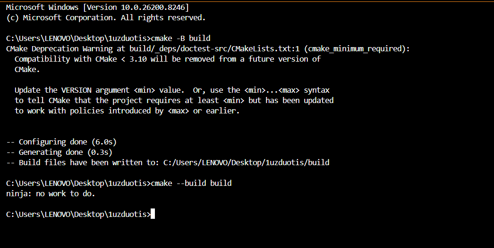
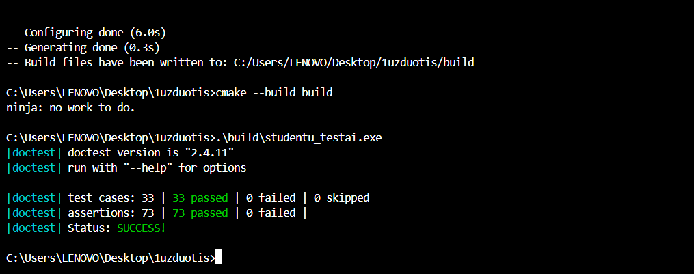
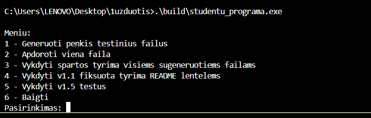
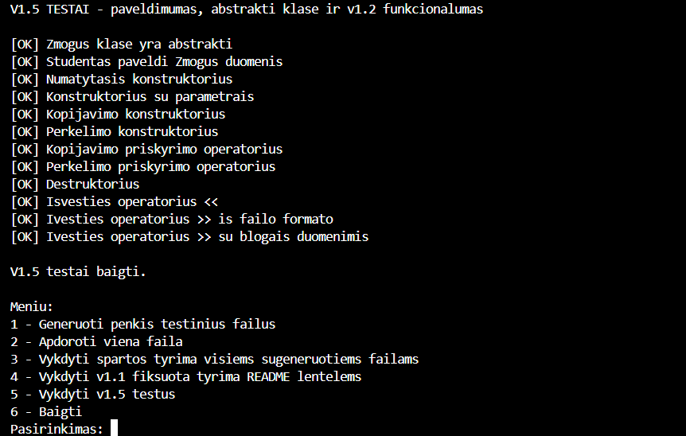
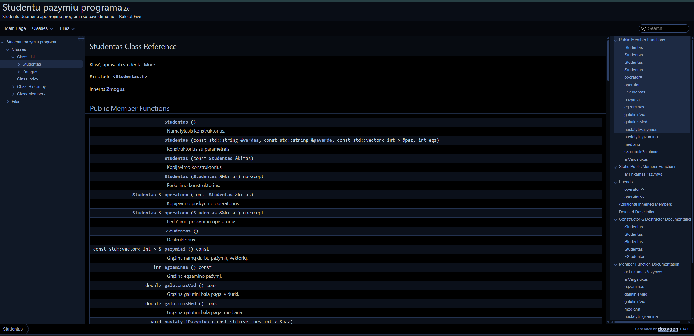

# Studentų pažymių analizės programa (v2.0)

## Aprašymas

Ši programa skirta studentų duomenų apdorojimui: pažymių nuskaitymui, galutinio balo skaičiavimui, rūšiavimui bei studentų skirstymui į grupes. Projektas realizuotas naudojant C++17, laikantis objektinio programavimo principų.

v2.0 versijoje pridėta:

* **Unit testai** naudojant [doctest](https://github.com/doctest/doctest) framework (TDD principu)
* **Doxygen dokumentacija** — HTML ir LaTeX/PDF formatais
* Atnaujinta diegimo instrukcija per CMake

---

## Klasių hierarchija

| Klasė | Tipas | Aprašymas |
|---|---|---|
| `Zmogus` | Abstrakti bazinė | Saugo vardą ir pavardę; grynai virtualus destruktorius |
| `Studentas` | Išvestinė iš `Zmogus` | Namų darbų pažymiai, egzaminas, galutinis balas |

---

## Programos funkcionalumas

| # | Funkcija |
|---|---|
| 1 | Generuoti testinius studentų failus |
| 2 | Nuskaityti duomenis iš failo ir padalinti į grupes |
| 3 | Spartos tyrimas su skirtingais konteineriais ir strategijomis |
| 4 | v1.1 fiksuoto scenarijaus tyrimas |
| 5 | v1.5 paveldimumo ir abstrakčios klasės testai |
| 6 | Baigti |

---

## Naudojamos technologijos

| Technologija | Paskirtis |
|---|---|
| C++17 | Pagrindinis standartas |
| STL (`vector`, `list`, `deque`) | Konteineriai |
| `ifstream` / `ofstream` | Failų skaitymas ir rašymas |
| [doctest v2.4.11](https://github.com/doctest/doctest) | Unit testų framework |
| Doxygen | Kodo dokumentacija |
| CMake 3.16+ | Projekto surinkimas |

---

## Diegimas ir surinkimas

### Reikalavimai

* CMake 3.16 ar naujesnė versija
* C++17 palaikantis kompiliatorius (GCC, Clang, MSVC)
* Interneto ryšys (pirmo surinkimo metu CMake atsisiunčia doctest)
* Doxygen (neprivaloma, dokumentacijos generavimui)

### Surinkimo žingsniai

```bash
# 1. Klonuoti repozitoriją
git clone https://github.com/Gvidas09/1uzduotis.git
cd 1uzduotis

# 2. Sukurti build katalogą ir konfigūruoti
cmake -B build

# 3. Sukompiliuoti
cmake --build build
```

Po surinkimo `build/` kataloge bus du vykdomieji failai:

| Failas | Paskirtis |
|---|---|
| `studentu_programa` | Pagrindinė programa |
| `studentu_testai` | Unit testų vykdomasis failas |

---

## Paleidimas

```bash
# Pagrindinė programa
./build/studentu_programa

# Unit testai
./build/studentu_testai

# Unit testai per CTest
cd build && ctest --output-on-failure
```

---

## Unit testai

Testai parašyti TDD principu naudojant **doctest** framework. Testų failas: `tests/StudentasTestai.cpp`.

### Testuojamos sritys

| Sritis | Testų skaičius |
|---|---|
| Konstruktoriai ir Rule of Five | 9 |
| `Zmogus` abstrakcija ir paveldimumas | 2 |
| Skaičiavimai (vidurkis, mediana, galutinis) | 7 |
| Validacija (`arTinkamasPazymys`, exception) | 3 |
| `arVargsiukas` (abu kriterijai, riba) | 5 |
| Srautų operatoriai (`>>`, `<<`) | 6 |

### Testų paleidimo pavyzdys

```
[doctest] doctest version is "2.4.11"
[doctest] run with "--help" for options
===============================================================================
[doctest] test cases: 33 | 33 passed | 0 failed | 0 skipped
[doctest] assertions: 73 | 73 passed | 0 failed |
[doctest] Status: SUCCESS!
```

---

## Doxygen dokumentacija

Dokumentuotos klasės: `Zmogus` ir `Studentas` (failai `Zmogus.h`, `Studentas.h`).

### Dokumentacijos generavimas

```bash
# Per CMake (jei Doxygen įdiegtas)
cmake --build build --target dokumentacija

# Arba tiesiogiai
doxygen Doxyfile
```

Dokumentacija išvedama į `docs/` katalogą:

| Formatas | Katalogas | Pagrindinis failas |
|---|---|---|
| HTML | `docs/html/` | `docs/html/index.html` |
| LaTeX | `docs/latex/` | `docs/latex/refman.tex` |

PDF generavimas iš LaTeX:

```bash
cd docs/latex && make
```

---

## Failų struktūra

```
1uzduotis/
├── Zmogus.h / Zmogus.cpp        ← abstrakti bazinė klasė
├── Studentas.h / Studentas.cpp  ← pagrindinė klasė
├── Failai.h / Failai.cpp        ← failų I/O ir skirstymo strategijos
├── Rikiavimas.h / Rikiavimas.cpp← rikiavimo funkcijos
├── Ivedimas.h / Ivedimas.cpp    ← meniu ir vartotojo įvedimas
├── Tyrimai.h / Tyrimai.cpp      ← spartos tyrimai
├── Testai.h / Testai.cpp        ← v1.5 paveldimumo testai
├── main.cpp                     ← programos įėjimo taškas
├── tests/
│   └── StudentasTestai.cpp      ← doctest unit testai
├── CMakeLists.txt               ← surinkimo konfigūracija
├── Doxyfile                     ← Doxygen konfigūracija
└── .gitignore
```

---

## Duomenų failo formatas

```
Vardas Pavarde ND1 ND2 ND3 ... Egz.
Jonas  Jonaitis 8   9  10    9
```

Galutinis balas skaičiuojamas pagal formulę:

> **Galutinis = 0.4 × ND_vidurkis + 0.6 × Egzaminas**

---

## Versijų istorija

| Versija | Pagrindiniai pakeitimai |
|---|---|
| v2.0 | doctest unit testai, Doxygen dokumentacija |
| v1.5 | `Zmogus` abstrakti bazinė klasė, paveldimumas |
| v1.2 | Rule of Five, `operator>>`, `operator<<` |
| v1.1 | Spartos tyrimas su `vector`, `list`, `deque` |
| v1.0 | Pagrindinė studentų apdorojimo programa |

---

## v2.0 ekrano nuotraukos

### Build

CMake projekto surinkimas — abu vykdomieji failai sukompiliuoti sėkmingai.



---

### Unit testai

doctest framework paleidimas — 33 testai, 0 klaidų.



---

### Programa — meniu ir v1.5 testai

Pagrindinės programos meniu ir v1.5 paveldimumo testų rezultatai.





---

### Doxygen dokumentacija

Sugeneruota HTML dokumentacija — `Studentas` klasės aprašymas.


